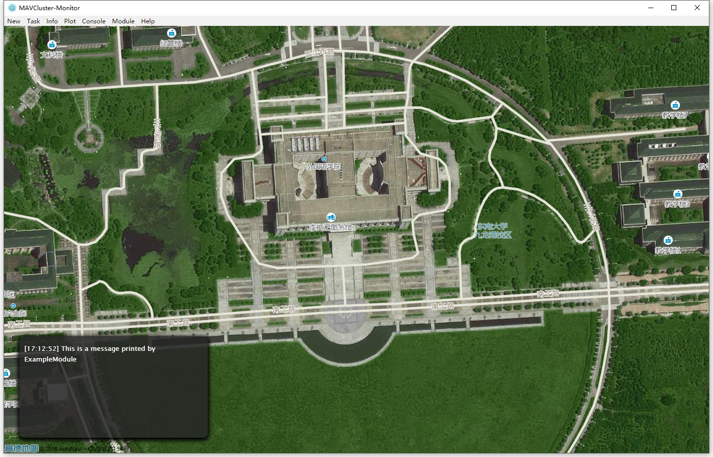
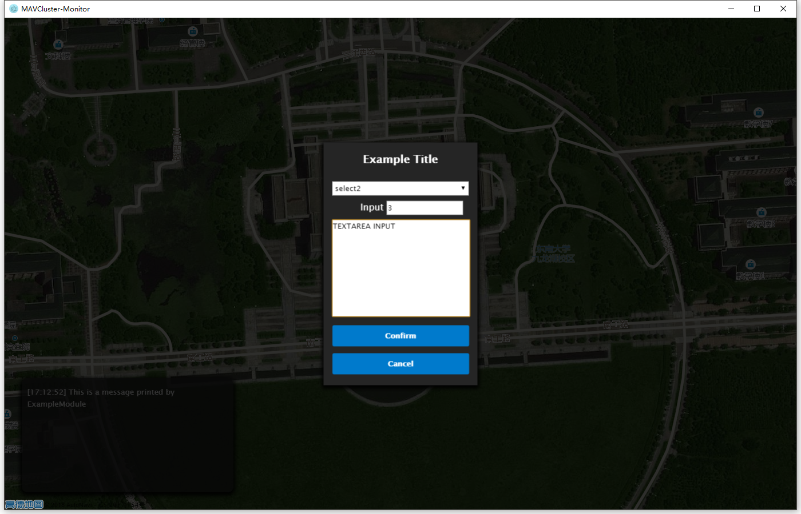
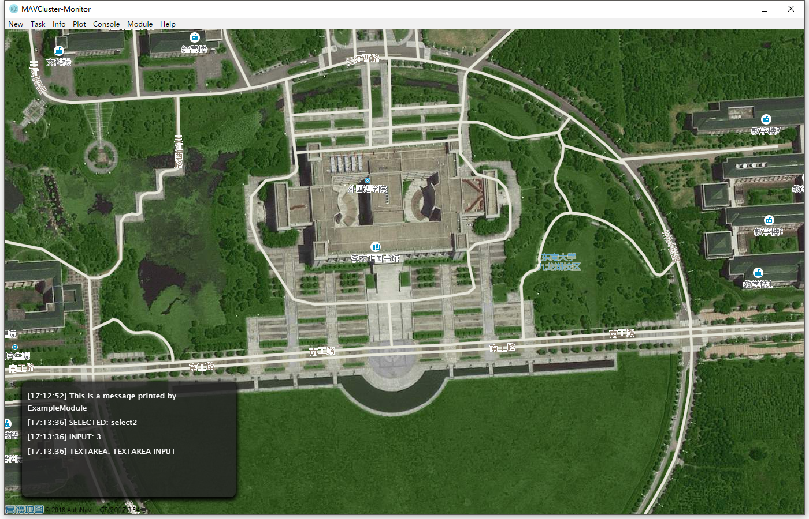
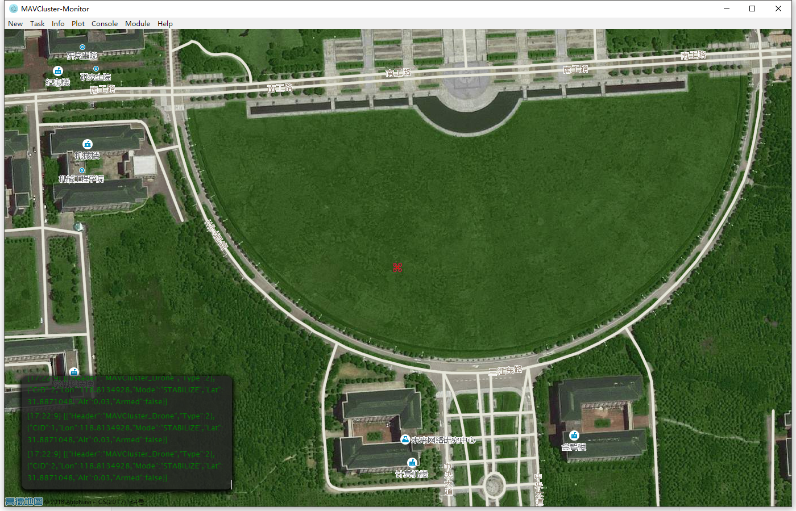

# User Module

To implement various functions, you can develop your own module which is able to interact with users of monitor and control drones in the cluster. We provide a simple guide in this chapter, for more information please check [API Reference](api.md).

## Quick Start

### Preparation

1.  Install [node.js](https://nodejs.org/)
2.  Install Electron via npm:

```shell
npm install -g electron
```

3.  Download the source of CoUAV:

```shell
git clone https://github.com/whxru/CoUAV.git
```

### Create and load an user module

An user module is a JavaScript file actually, structure of every user module should be like this:

```javascript
const { UserModule, myConsole, wd } = require('./user_module')

class ExampleModule extends UserModule {
  constructor(name, droneCluster) {
     super(name, droneCluster); // Call constructor in UserModule
    
     // Your code here
  }
}

// The init function will be called automatically while loading this module.
module.exports.init = function(droneCluster) {
   new ExampleModule('module-name', droneCluster);
}

```

Assume that you create a file which is named `mavc_example.js` and it contains the code above. Now move this file to the path `CoUAV/monitor/user-module`, add the file name to `load.json`, change current work directory to `CoUAV/monitor`, rebuild the application from source: 

```
electron .
```

After selecting a network interface, you could find an menu-item which is named 'module-name' by clicking `Module` in menu: 


## Example

After the following example module is loaded, the monitor will be like this:  it adds two commands to the menu and handle all messages sent by both monitor and drones:

*   Command `Console`: Print "This is a message printed by ExampleModule" on console
*   Command `Input`: Create a modal (which means you can do nothing before closing this dialog) dialog which contains various HTML elements:  After clicking the "Confirm" button, the value of input elements print on the console: 
*   Message-in/out: In-message will be printed in color green and out-message will be pink.

```javascript
const { UserModule, myConsole, wd } = require('./user_module')

/**
 * Example of developing a user's own module.
 * @class ExampleModule
 * @extends {UserModule}
 */
class ExampleModule extends UserModule {
    /**
     * Creates an instance of ExampleModule.
     * @param {String} name - The name of the module.
     * @param {DroneCluster} droneCluster - Cluster of drones.
     * @memberof ExampleModule
     */
    constructor(name, droneCluster) {
         // Call constructor of UserModule, it'll add an item to menu for this module
        super(name, droneCluster);

        // Add command to menu
        this.addCommand('Console', () => {
            // Print message on console.
            myConsole.log("This is a message printed by ExampleModule");
        })

        this.addCommand('Input', () => {
            // Create an dialog to wait for user's input and show it
            var inputSet = new wd.InputSet({
                'title': 'Example Title',
                'middle': true, // vergical align
                'modal': true
            }).showOnTop();

            // Add a <select> element to the dialog
            var select = inputSet.addSelect(['select1', 'select2', 'select3']);
            // Add an <input> element to the dialog
            var input = inputSet.addInput('Input', {
                'type': 'number', 'min': '1', 'max': '50'
            });
            // Add a <textarea> element to the dialog
            var textarea = inputSet.addTextarea({ rows: 8});

            // Add a confirm button to the dialog
            var confirm = inputSet.addButton('Confirm', () => {
                // Get value of elements
                var selectedValue = select.options[select.selectedIndex].value;
                var input_str = input.value;
                var textarea_str = textarea.value;
                // Remove this dialog
                inputSet.remove()
                // Print user's input on console
                myConsole.log('SELECTED: ' + selectedValue);
                myConsole.log('INPUT: ' + input_str);
                myConsole.log('TEXTAREA: ' + textarea_str);
            });
            
            // Add a cancel button to the dialog
            var cancel = inputSet.addButton('Cancel', () => {
                // Remove this dialog
                inputSet.remove();
            })
        })

        // Handle every message sent by drone
        this.addMsgListener('message-in', (CID, msg_obj) => {
            myConsole.log(JSON.stringify(msg_obj), 'green');
        });
        
        // Handle every message sent by monitor
        this.addMsgListener('message-out', (CID, msg_obj) => {
            myConsole.log(JSON.stringify(msg_obj), 'pink');
        })
    }
}

// The init function will be called automatically while loading this module.
function init(droneCluster) {
    new ExampleModule('example', droneCluster);
}

module.exports.init = init;
```


